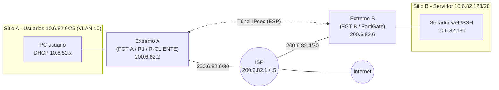

# Laboratorios VPN Site-to-Site IPsec en PNETLab (FortiGate + Cisco)

## 🎥 Video demostrativo

[](https://youtu.be/iaqEtzMtiSM)

**▶ https://youtu.be/iaqEtzMtiSM**

---

| | |
|---|---|
| **Nombre** | Mario De León |
| **Matrícula** | 20250682 |
| **Materia** | Seguridad de Redes |
| **Maestro** | Jonathan Rondon |

## Propósito del laboratorio

Diseñar, implementar y comprobar **túneles VPN IPsec site-to-site** sobre un ISP simulado en PNETLab, usando firewalls **FortiGate** (configurados por GUI) y routers **Cisco IOL**. El objetivo es demostrar que:

1. Dos redes privadas con direccionamiento `10.6.82.x` se comunican **únicamente a través de un túnel cifrado**, porque el ISP solo conoce las IP públicas `200.6.82.x` y no tiene rutas hacia las redes privadas.
2. Se pueden aplicar servicios de red reales (VLAN 10, DHCP, NAT, VIP, políticas de firewall) y se puede **probar** el funcionamiento con ping, traceroute, HTTPS y SSH.
3. Los dos extremos del túnel deben coincidir exactamente en los parámetros de Fase 1 (IKE) y Fase 2 (IPsec), incluso entre fabricantes distintos.

## Las tres prácticas

| Práctica | Extremos de la VPN | Qué demuestra | Documentación |
|---|---|---|---|
| **Infra 1** | FortiGate ↔ FortiGate | VPN con asistente IPsec, VLAN 10 con DHCP en el FortiGate, ruta blackhole que bloquea el tráfico si el túnel cae | [docs/infra1.md](docs/infra1.md) |
| **Infra 2** | Cisco R1 ↔ FortiGate | VPN multi-vendor, NAT con exclusión del tráfico VPN, demostración de que sin túnel no hay comunicación | [docs/infra2.md](docs/infra2.md) |
| **Infra 3** | Cisco R-CLIENTE ↔ FortiGate | VPN + **VIP** (HTTPS publicado sin VPN) + **SSH solo por VPN** | [docs/infra3.md](docs/infra3.md) |

## Diagrama general del direccionamiento



## Estructura del repositorio

```
.
├── README.md                 ← este archivo (video al inicio)
├── docs/
│   ├── infra1.md             ← FortiGate ↔ FortiGate
│   ├── infra2.md             ← Cisco R1 ↔ FortiGate
│   └── infra3.md             ← Cisco R-CLIENTE ↔ FortiGate (VIP + SSH por VPN)
├── images/                   ← topologías y evidencias (capturas)
├── scripts/
│   ├── infra1/ infra2/ infra3/   ← todo lo pegado en consolas/terminales (.ios, .sh, .bat, .txt)
└── configs/
    ├── infra1/ infra2/ infra3/   ← running-configs y archivos de configuración reales
    └── fortigate/                ← ver README (exportar con "show full-configuration")
```

## Tecnologías

PNETLab · Cisco IOL (L2/L3, 15.x) · FortiGate-VM (GUI) · Ubuntu Server 22.04 (nginx / Apache) · Kali Linux · Windows 10 (administración)

## Parámetros de la VPN (resumen)

| Parámetro | Infra 1 | Infra 2 | Infra 3 |
|---|---|---|---|
| Fase 1 | IKE FortiGate (asistente) | IKEv1 Main, DES, DH 2, PSK | IKEv1 Main, DES, DH 2, PSK |
| Fase 2 | ESP del asistente | ESP-DES / ESP-SHA-HMAC, sin PFS | ESP-DES / ESP-SHA-HMAC, sin PFS |
| Clave PSK | `Lab0682!` | `Clave0682` | `Clave0682` |
| Tráfico protegido | 10.6.82.0/25 ↔ 10.6.82.128/28 | igual | igual |

> ⚠️ DES y las claves precompartidas se usan **solo en laboratorio**. DES está obsoleto y no debe usarse en producción.
