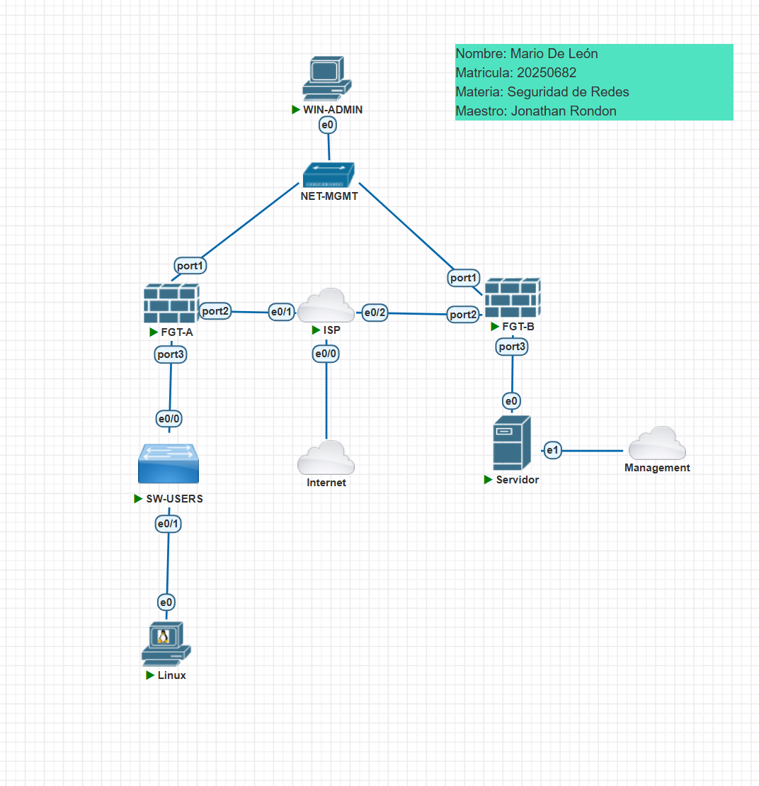
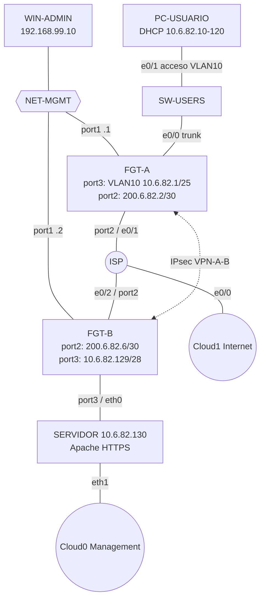
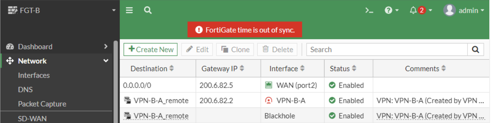
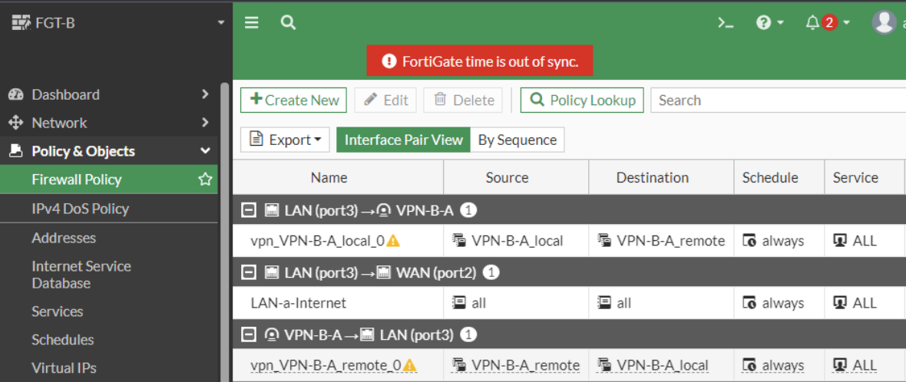
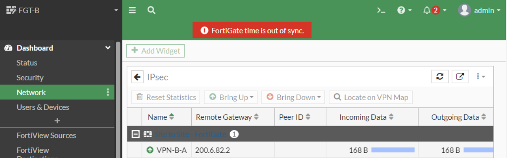
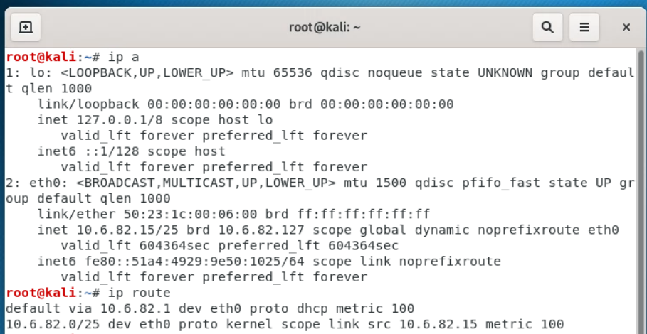
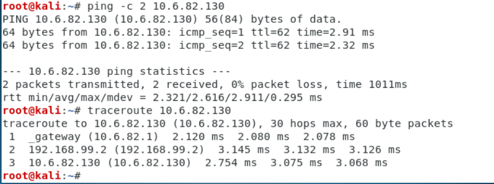
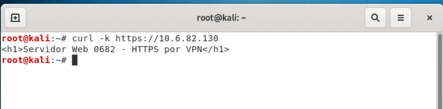
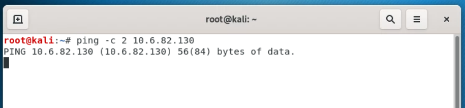

# Infra 1 — VPN Site-to-Site FortiGate ↔ FortiGate

[← Volver al README](../README.md)

## Propósito

Conectar un sitio de **usuarios** (VLAN 10, FGT-A) con un sitio de **servidor** (FGT-B) mediante un túnel IPsec creado con el *IPsec Wizard* de FortiGate, y demostrar que **solo hay comunicación mientras el túnel está activo**.

## Topología

## Direccionamiento

| Red | Dirección | Detalle |
|---|---|---|
| Usuarios (VLAN 10) | 10.6.82.0/25 | GW 10.6.82.1 (FGT-A). DHCP .10–.120 |
| Servidor | 10.6.82.128/28 | GW 10.6.82.129 (FGT-B), servidor .130 |
| ISP ↔ FGT-A | 200.6.82.0/30 | ISP .1, FGT-A .2 |
| ISP ↔ FGT-B | 200.6.82.4/30 | ISP .5, FGT-B .6 |
| Management | 192.168.99.0/24 | FGT-A .1, FGT-B .2, Windows .10 |

## Conexiones

| # | Origen | Destino | Función |
|---|---|---|---|
| 1 | Cloud1 | ISP e0/0 | Internet |
| 2 | ISP e0/1 | FGT-A port2 | WAN A |
| 3 | ISP e0/2 | FGT-B port2 | WAN B |
| 4 | FGT-A port3 | SW-USERS e0/0 | Troncal VLAN 10 |
| 5 | SW-USERS e0/1 | PC-USUARIO eth0 | Acceso VLAN 10 |
| 6 | FGT-B port3 | SERVIDOR eth0 | LAN servidor |
| 7 | SERVIDOR eth1 | Cloud0 | SSH desde PNETLab |
| 8–10 | FGT-A/B port1, WIN-ADMIN | NET-MGMT | Management |

## Implementación

1. **ISP, switch y consola de FortiGate:** [`scripts/infra1/isp.ios`](../scripts/infra1/isp.ios), [`sw-users.ios`](../scripts/infra1/sw-users.ios), [`fortigate-mgmt-fgt-a.txt`](../scripts/infra1/fortigate-mgmt-fgt-a.txt), [`fortigate-mgmt-fgt-b.txt`](../scripts/infra1/fortigate-mgmt-fgt-b.txt).
2. **Servidor:** [`servidor-paso-a-instalacion.sh`](../scripts/infra1/servidor-paso-a-instalacion.sh) + [`configs/infra1/servidor-netplan.yaml`](../configs/infra1/servidor-netplan.yaml).
3. **Windows y PC:** [`windows-admin.bat`](../scripts/infra1/windows-admin.bat), [`pc-usuario.sh`](../scripts/infra1/pc-usuario.sh).
4. **FortiGate por GUI** (https://192.168.99.1 y .2):
   - Interfaces WAN/LAN, subinterfaz **VLAN10** con servidor DHCP (FGT-A), DNS, ruta por defecto.
   - Política `LAN-a-Internet` con NAT.
   - **VPN → IPsec Wizard** (Site to Site, FortiGate, PSK `Lab0682!`, sin NAT entre sitios). Crea Fase 1/2, direcciones, políticas ida/vuelta y rutas.

### Ruta Blackhole y políticas (FGT-A)

El asistente crea una ruta *Blackhole* con distancia 254: si el túnel cae, el tráfico hacia la red remota se descarta y **no puede salir sin cifrar**.

## Pruebas y evidencias

**Túnel activo** (IPsec Monitor de FGT-B):

**DHCP y conectividad por VPN desde el PC de usuario:**

**HTTPS al servidor a través de la VPN:**

**Sin VPN (puerto WAN deshabilitado) la comunicación se pierde:**

## Configuraciones

- [`configs/infra1/ISP-running-config.txt`](../configs/infra1/ISP-running-config.txt)
- [`configs/infra1/SW-USERS-running-config.txt`](../configs/infra1/SW-USERS-running-config.txt)
- [`configs/infra1/servidor-netplan.yaml`](../configs/infra1/servidor-netplan.yaml)
- FortiGate A/B: ver [`configs/fortigate/`](../configs/fortigate/LEEME.txt)
