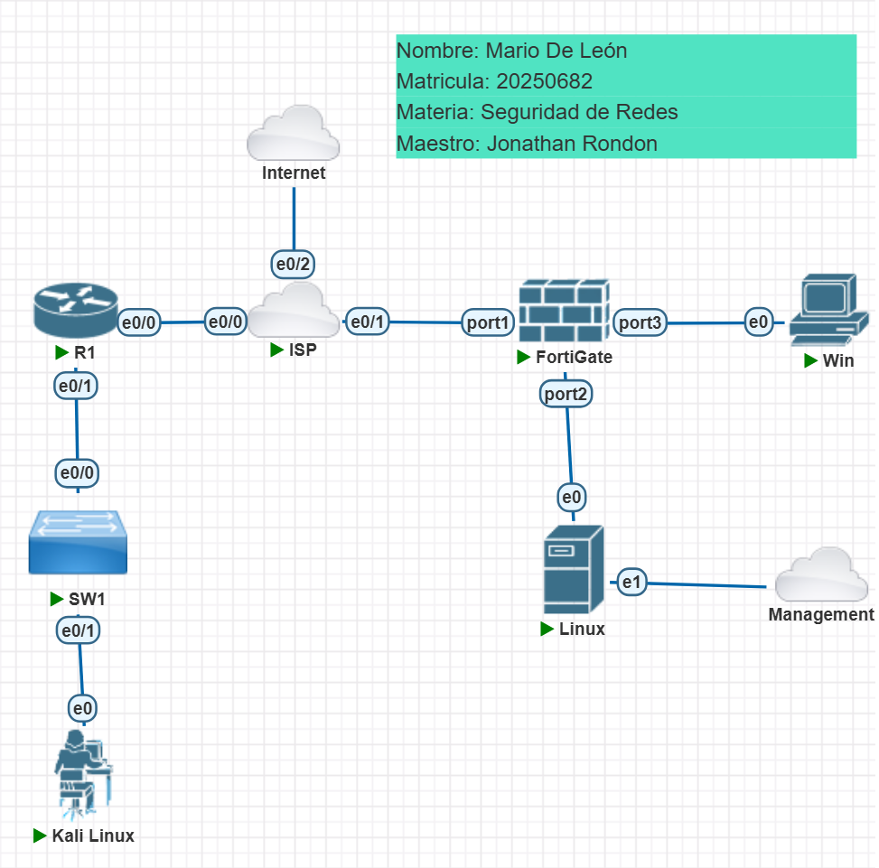
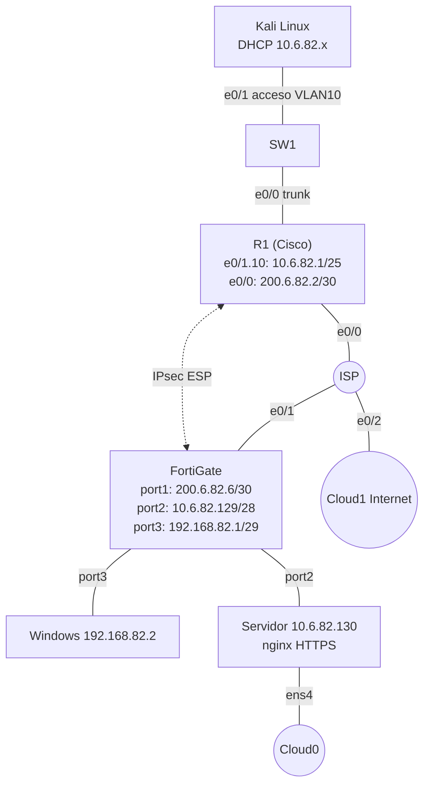
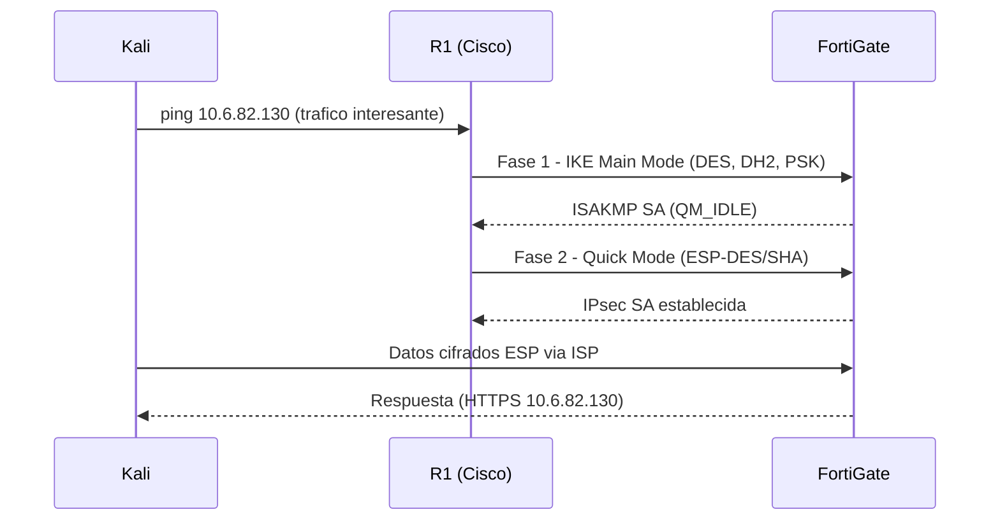
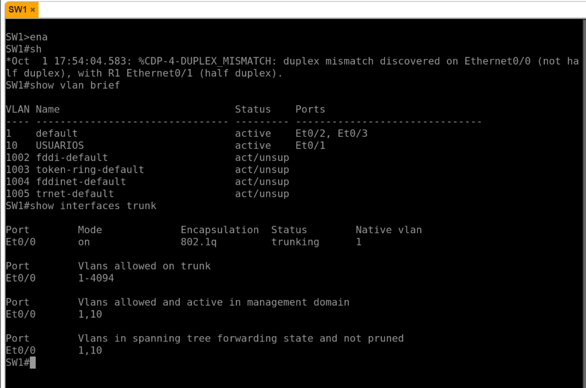
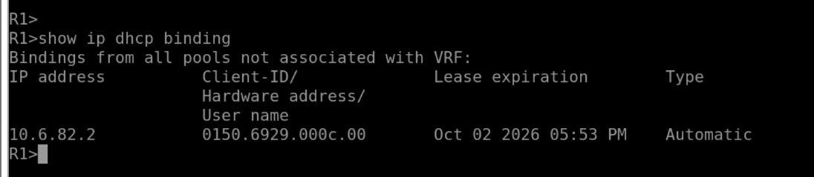
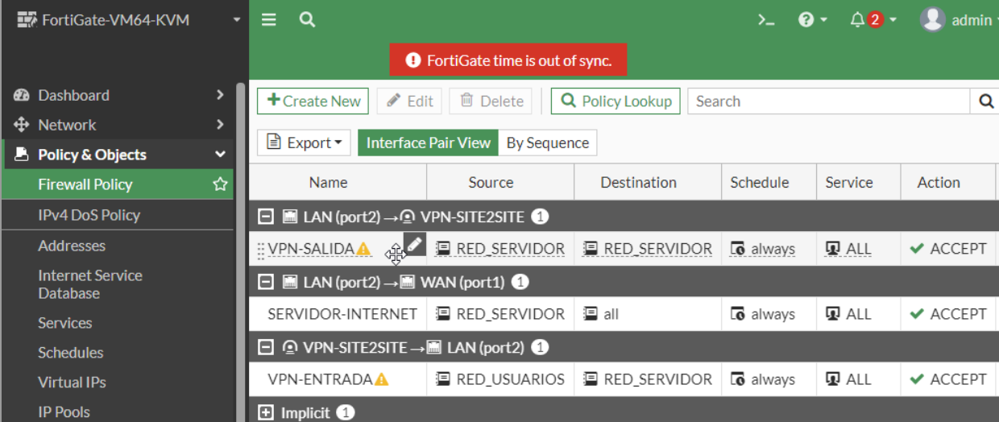
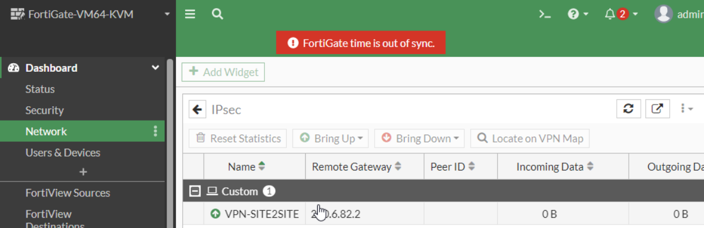
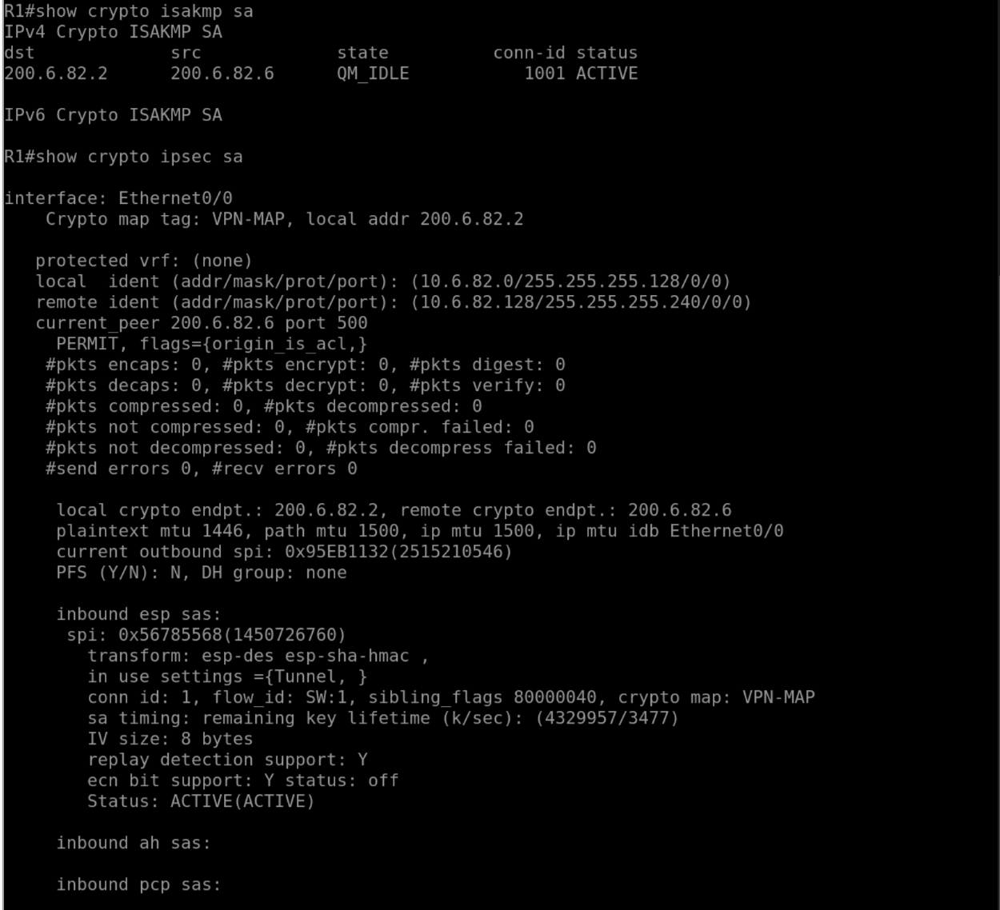
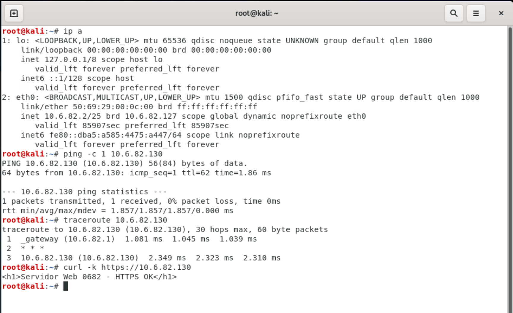
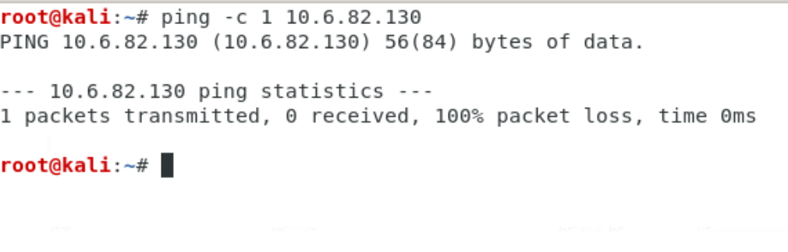

# Infra 2 — VPN Site-to-Site Cisco (R1) ↔ FortiGate

[← Volver al README](../README.md)

## Propósito

Establecer un túnel IPsec **entre fabricantes distintos**: un router Cisco IOL (lado usuarios) y un FortiGate (lado servidor), y comprobar que el servidor web HTTPS solo es alcanzable cuando la VPN está activa.

## Topología

## Direccionamiento

| Red | Subred | Detalle |
|---|---|---|
| Usuarios VLAN 10 | 10.6.82.0/25 | GW R1 .1, DHCP |
| Servidor | 10.6.82.128/28 | GW FortiGate .129, servidor .130 |
| ISP ↔ R1 | 200.6.82.0/30 | ISP .1, R1 .2 |
| ISP ↔ FortiGate | 200.6.82.4/30 | ISP .5, FortiGate .6 |
| Administración | 192.168.82.0/29 | FortiGate .1, Windows .2 |

## Parámetros de la VPN

| Parámetro | Valor |
|---|---|
| IKE | v1, Main mode, PSK `Clave0682` |
| Fase 1 | DES, DH grupo 2, lifetime 86400 |
| Fase 2 | ESP-DES / ESP-SHA-HMAC, modo túnel, **sin PFS**, lifetime 3600 |
| Tráfico interesante | 10.6.82.0/25 ↔ 10.6.82.128/28 |
| NAT en R1 | ACL 100 excluye (`deny`) el tráfico hacia el servidor |

> La imagen IOL solo ofrecía DES para cifrado; el `running-config` final muestra `esp-sha-hmac` en la Fase 2. **El FortiGate debe tener la misma propuesta** (cifrado y hash idénticos) para que la Fase 2 suba.

## Implementación

| Equipo | Script |
|---|---|
| ISP | [`scripts/infra2/isp.ios`](../scripts/infra2/isp.ios) |
| SW1 | [`scripts/infra2/sw1.ios`](../scripts/infra2/sw1.ios) |
| R1 | [`scripts/infra2/r1.ios`](../scripts/infra2/r1.ios) |
| FortiGate (consola) | [`scripts/infra2/fortigate-consola.txt`](../scripts/infra2/fortigate-consola.txt) |
| Windows | [`scripts/infra2/windows-admin.bat`](../scripts/infra2/windows-admin.bat) |
| Servidor | [`scripts/infra2/servidor.sh`](../scripts/infra2/servidor.sh) + [netplan](../configs/infra2/servidor-netplan.yaml) |
| Kali | [`scripts/infra2/kali-pruebas.sh`](../scripts/infra2/kali-pruebas.sh) |

El FortiGate se configura por GUI (https://192.168.82.1): interfaces, ruta por defecto, objetos `RED_SERVIDOR` / `RED_USUARIOS`, túnel IPsec personalizado, ruta por el túnel (AD 10) y ruta **Blackhole** (AD 254), y tres políticas: `VPN-SALIDA`, `VPN-ENTRADA` y `SERVIDOR-INTERNET` (con NAT).

## Evidencias

**SW1 (VLAN 10 y troncal) y R1:**

**FortiGate: túnel y configuración:**

**Fases ISAKMP e IPsec en R1:**

**Pruebas desde Kali** (IP por DHCP, ping, traceroute y `curl -k https://10.6.82.130`):

El segundo salto del traceroute aparece como `* * *`: el túnel cifrado oculta los saltos del ISP.

**Sin VPN (enlace del ISP caído):**

## Configuraciones

[ISP](../configs/infra2/ISP-running-config.txt) · [R1](../configs/infra2/R1-running-config.txt) · [SW1](../configs/infra2/SW1-running-config.txt) · [netplan](../configs/infra2/servidor-netplan.yaml) · [nginx](../configs/infra2/servidor-nginx-default.conf) · FortiGate: [`configs/fortigate/`](../configs/fortigate/LEEME.txt)
