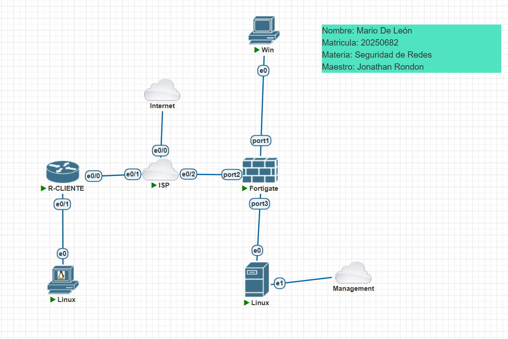
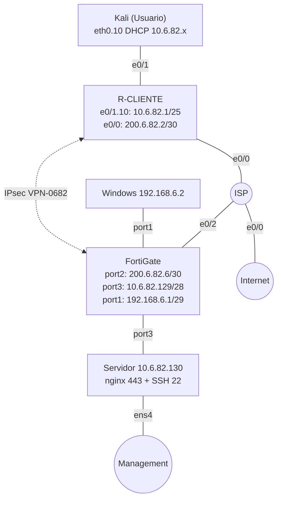
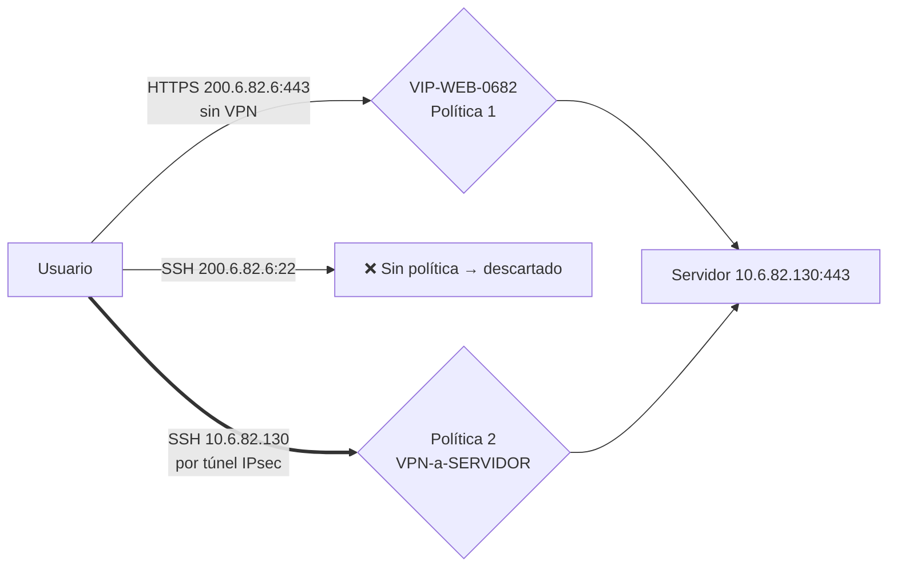
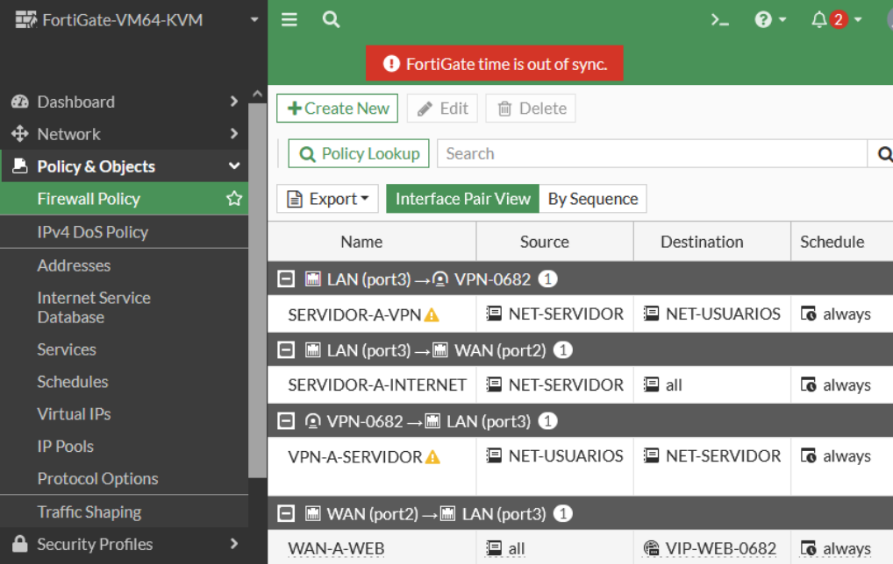
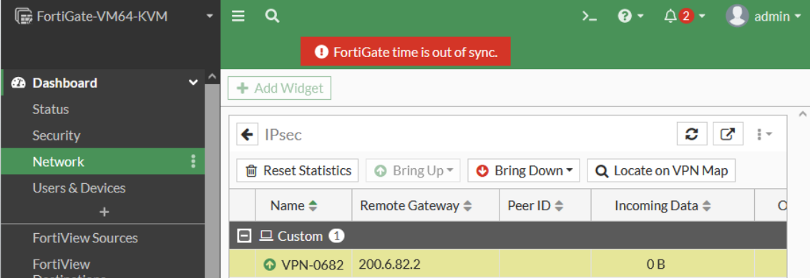
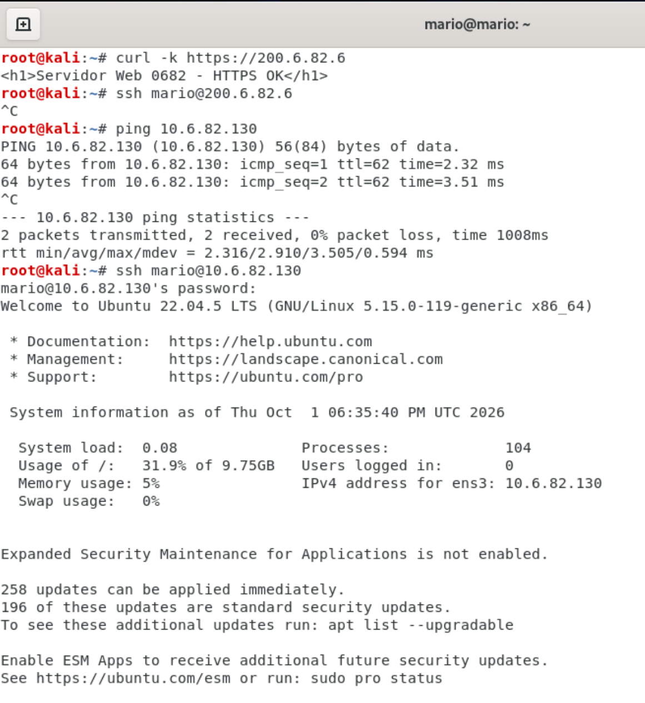
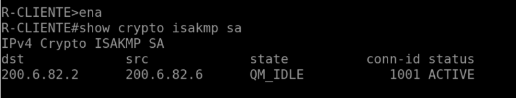
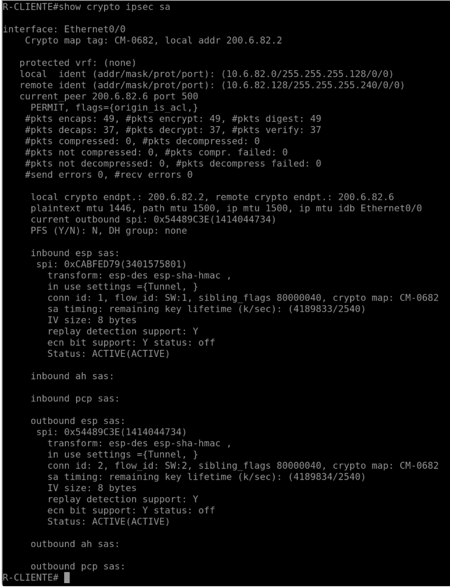

# Infra 3 — VPN Cisco (R-CLIENTE) ↔ FortiGate con VIP y SSH solo por VPN

[← Volver al README](../README.md)

## Propósito

Además del túnel IPsec, aplicar **políticas de acceso diferenciadas** en el FortiGate:

1. **Objetivo 1:** el servidor web es accesible por **HTTPS sin VPN** (publicado con una **VIP** en `200.6.82.6:443`).
2. **Objetivo 2:** el **SSH** solo es accesible **a través de la VPN** (`10.6.82.130`).

## Topología

## Direccionamiento

| Red | Subred | Equipos |
|---|---|---|
| ISP ↔ R-CLIENTE | 200.6.82.0/30 | ISP .1, R-CLIENTE .2 |
| ISP ↔ FortiGate | 200.6.82.4/30 | ISP .5, FortiGate port2 .6 |
| Usuarios VLAN 10 | 10.6.82.0/25 | R-CLIENTE .1, Kali DHCP desde .10 |
| Servidor | 10.6.82.128/28 | FortiGate port3 .129, servidor .130 |
| Gestión FortiGate | 192.168.6.0/29 | port1 .1, Windows .2 |

> En esta práctica la VLAN 10 se etiqueta en el propio Kali (`eth0.10`), porque no hay switch entre Kali y R-CLIENTE: [`kali-vlan10.sh`](../scripts/infra3/kali-vlan10.sh).

## Política de acceso

| # | Nombre | Entrada | Salida | Origen | Destino | Servicio | NAT |
|---|---|---|---|---|---|---|---|
| 1 | WAN-a-WEB | port2 | port3 | all | VIP-WEB-0682 | HTTPS | Off |
| 2 | VPN-a-SERVIDOR | VPN-0682 | port3 | NET-USUARIOS | NET-SERVIDOR | SSH, ALL_ICMP | Off |
| 3 | SERVIDOR-a-VPN | port3 | VPN-0682 | NET-SERVIDOR | NET-USUARIOS | ALL | Off |
| 4 | SERVIDOR-a-INTERNET | port3 | port2 | NET-SERVIDOR | all | ALL | On |

## Implementación

| Equipo | Script |
|---|---|
| ISP | [`isp.ios`](../scripts/infra3/isp.ios) |
| R-CLIENTE | [`r-cliente.ios`](../scripts/infra3/r-cliente.ios) |
| FortiGate (consola) | [`fortigate-consola.txt`](../scripts/infra3/fortigate-consola.txt) |
| Windows | [`windows-admin.bat`](../scripts/infra3/windows-admin.bat) |
| Servidor | [`servidor.sh`](../scripts/infra3/servidor.sh), [netplan](../configs/infra3/servidor-netplan.yaml), [nginx](../configs/infra3/servidor-nginx-web0682.conf) |
| Kali | [`kali-vlan10.sh`](../scripts/infra3/kali-vlan10.sh), [`pruebas.sh`](../scripts/infra3/pruebas.sh) |

FortiGate por GUI: interfaces, ruta por defecto, objetos `NET-USUARIOS`, `NET-SERVIDOR`, `SRV-WEB`, **VIP** `VIP-WEB-0682` (200.6.82.6:443 → 10.6.82.130:443), túnel `VPN-0682` (DES, DH 2, sin PFS), ruta hacia los usuarios por el túnel y las 4 políticas.

### Evidencias en el FortiGate

## Pruebas y evidencias

**HTTPS sin VPN funciona; SSH a la IP pública falla; con VPN el SSH entra:**

**Estado del túnel:**

## Configuraciones

[ISP](../configs/infra3/ISP-running-config.txt) · [R-CLIENTE](../configs/infra3/R-CLIENTE-running-config.txt) · [netplan](../configs/infra3/servidor-netplan.yaml) · [nginx](../configs/infra3/servidor-nginx-web0682.conf) · FortiGate: [`configs/fortigate/`](../configs/fortigate/LEEME.txt)
